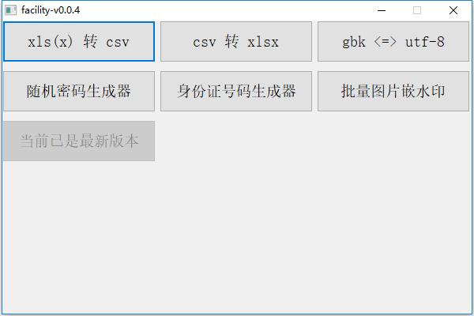

# facility

### Overview

facility: a tool set for

- xls(x) to csv
- csv to xlsx
- gbk to/from utf-8
- random password generate-tool
- ID generate-tool
- image watermark embed-tool

[Click to Download](https://github.com/Gnekiah/facility/releases)

## Preview

